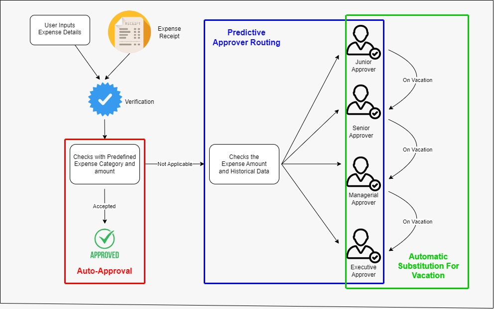

# 💰 Expense Approval Workflow  


## 📌 Problem Statement  
Managing expense approvals manually can be time-consuming and inefficient, especially in organizations with multiple approvers and varying approval limits. The **Expense Approval Workflow** powered by a **Small Language Model (SLM)** streamlines this process by automating key aspects:  

🔹 **Automatic substitution** based on vacation periods  
🔹 **Predicting approvers** and auto-routing based on spending limits  
🔹 **Auto-approving expenses** based on predefined compliance checks  

---

## 💡 Solution  
This project leverages **Generative AI (GenAI)** to create an intelligent **expense approval system** that:  

✔ **Automatically assigns substitute approvers** when the primary approver is on vacation.  
✔ **Predicts the appropriate approver** based on historical data and spending limits.  
✔ **Auto-approves routine expenses** that meet compliance requirements.  

---

---
## 🚀 Key Features  

### ✅ Automatic Substitution for Vacations  
- 📅 Detects when an approver is on leave.  
- 🔄 Assigns a substitute to ensure uninterrupted workflow.  

### 🔄 Predictive Approver Routing  
- 📊 Analyzes past approvals and spending limits.  
- 🏷 Predicts the best approver for each expense request.  

### 🤖 Auto-Approval of Routine Expenses  
- 📜 Predefined rules check if expenses meet compliance.  
- ⚡ Eligible expenses are **auto-approved** to minimize manual intervention.  

---

## ⚙️ Tech Stack  
- **🖥 Backend**: Flask  
- **🗄 Database**: PostgreSQL  
- **🤖 ML Model**: DistilBERT (Hugging Face Transformers)  
- **📚 Libraries**: Flask-CORS, psycopg2-binary, transformers, torch  

---

## 📂 Project Setup

### 1️⃣ Install Dependencies
Ensure Python and PostgreSQL is installed, then run:
```sh
pip install flask flask-cors psycopg2-binary transformers torch safetensors
```

### 2️⃣ Set Up the Database
Ensure PostgreSQL is running. Apply migrations if needed:
```sh
python manage.py migrate
```

### 3️⃣ Start the Flask Server
Run the following command:
```sh
flask run
```
or
```sh
python -m flask run
```
By default, it runs on [http://127.0.0.1:5000/](http://127.0.0.1:5000/).

---

## 📜 API Endpoints

### 🔹 Expense Prediction API

- **Endpoint:** `POST /predict`
- **Request Body (JSON):**
  ```json
  {
    "expenseCategory": "Travel",
    "amount": 100
  }
  ```
- **Response:**
  ```json
  {
    "predicted_class": "Manager Approval Required",
    "probabilities": [0.7, 0.2, 0.1]
  }
  
---

## 🎯 Running the Frontend

To integrate with your frontend, use JavaScript to send API requests:

```js
async function classifyExpense() {
    let category = document.getElementById("category-input").value;
    let amount = document.getElementById("amount-input").value;

    let response = await fetch("http://127.0.0.1:5000/predict", {
        method: "POST",
        headers: { "Content-Type": "application/json" },
        body: JSON.stringify({ expenseCategory: category, amount: amount })
    });

    let result = await response.json();
    document.getElementById("result").innerText = "Prediction: " + result.predicted_class;
}
```

---

## 🛠 Setting Up the Model

### 1️⃣ Store Model Locally
Ensure the model file is in your project directory:

```python
model_path = r"C:\Users\Dakshin Priya\Your-Project-Folder\model.safetensors" # Replace with your actual model path
model = load_model(model_path)
```

### 2️⃣ Automate Model Download (Optional)
If not stored locally, download it dynamically:

```python
import os
import requests

model_path = "model.safetensors"
if not os.path.exists(model_path):
    url = "https://your-drive-link/model.safetensors"
    response = requests.get(url)
    with open(model_path, "wb") as f:
        f.write(response.content)

model = load_model(model_path)
```

Replace `https://your-drive-link/model.safetensors` with the actual download URL.

---

## 📌 Why Use a Virtual Environment?

Creating a virtual environment prevents conflicts between dependencies. Follow these steps:

### 1️⃣ Install Virtualenv
```sh
pip install virtualenv
```

### 2️⃣ Create and Activate a Virtual Environment
```sh
python -m venv venv
```

#### Windows
```sh
venv\Scripts\activate
```

#### macOS/Linux
```sh
source venv/bin/activate
```

To deactivate the virtual environment, run:
```sh
deactivate
